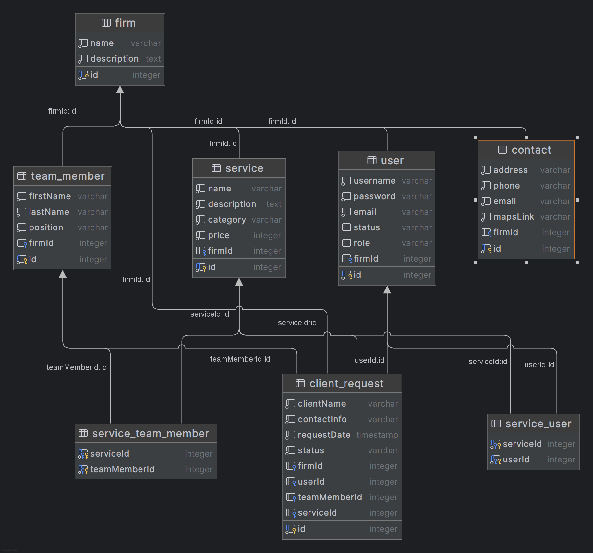

## В рамках юридической фирмы, были выделены следующие поддомены:

- **Компания (Firm)** — информация о юридической фирме.
- **Услуга (Service)** — описание различных услуг, которые фирма предоставляет. 
- **Член команды (TeamMember)** — информация о членах команды (юристах, консультантах и тд). 
- **Запрос пользователя (ClientRequestEntity)** — cущность, которая представляет заявку или запрос клиента на оказание юридических услуг. Это может быть запрос через форму на сайте или контакт с компанией.
- **Контакт (Contact)** — контактная информация, включая формы для связи с фирмой.
- **Пользователь (User)** - сущность, которая представляет пользователя сайта. Она будет связана с процессом аутентификации и авторизации.

## Подробней о каждой сущности:
### Firm
_Свойства:_

1) **id**: Уникальный идентификатор компании.
2) **name**: Название компании.
3) **description**": Описание компании.

_Обоснование, почему она все-таки нужна:_

Выделение отдельной сущности для фирмы может облегчить поддержку и развитие системы в будущем.
Информация о фирме требуется на разных страницах сайта, и с помощью выделенной сущности можно централизованно управлять ею. В будущем легко также будет обновить или расширить описание компании, не изменяя логику других сущностей.
В рамках DDD, эта сущность может быть частью контекста "Компания" (например, контекст "Компания" может включать всю информацию о фирме, услуги, команду и т. д.), и использоваться в бизнес-логике для других операций.

### User
_Свойства_:

1) **id**: Уникальный идентификатор пользователя. 
2) **username**: Логин пользователя.
3) **password**: Пароль пользователя. 
4) **email**: Электронная почта. 
5) **status**: Статус ("Авторизован" или "Не авторизован"). 
6) role: Роль пользователя (например, "Администратор", "Сотрудник", "Клиент").

_Методы_:

1) **login()**: Метод для авторизации пользователя. 
2) **logout()**: Метод для выхода из системы.

### Service
_Свойства:_
1) **id**: Уникальный идентификатор услуги. 
2) **name**: Название услуги. 
3) **description**: Описание услуги. 
4) **category**: Категория услуги (например, "Судебные споры", "Споры с таможней"). 
5) **price**: Цена услуги в руб. (примерная).

Методы:
1) **getServiceDetails()**: Получить подробности услуги.

### TeamMember

_Свойства:_

1) **id**: Уникальный идентификатор члена команды. 
2) **firstName**: Имя члена команды. 
3) **lastName**: Фамилия члена команды.
4) **position**: Роль в компании (например, "Юрист", "Менеджер").

_Методы:_

1) **getMemberDetails()**: Получить подробную информацию о члене команды.

### ClientRequestEntity
_Свойства:_

1) **id**: Уникальный идентификатор запроса. 
2) **clientName**: Имя клиента. 
3) **contactInfo**: Контактная информация клиента. 
4) **serviceRequested**: Запрашиваемая услуга. 
5) **requestDate**: Дата запроса. 
6) **status**: Статус запроса ("В процессе" или "Завершен").

_Методы:_

1) **updateRequestStatus()**: Метод для обновления статуса запроса. 
2) **getRequestDetails()**: Получить подробности о запросе.

### Contact
_Свойства:_

1) **address**: Адрес компании.
2) **phone**: Телефон компании.
3) **email**: Электронная почта компании.
4) **mapsLink**: Ссылка на местоположение на карте (Google Maps).

_Методы:_

1) **getContactDetails()**: Получить контактные данные компании.

## Связи между сущностями

- User ↔️ ClientRequest: Каждый пользователь может оставить несколько запросов через форму на сайте. 
- Service ↔️ ClientRequest: Запрос клиента может быть на определенную услугу, каждый запрос привязан к конкретной услуге. 
- TeamMember ↔️ Service: Услуги могут предоставляться как конкретными членами команды, так и несколькими. В обратную сторону так же. 
- User ↔️ TeamMember: Администратор или авторизованный пользователь может просматривать информацию о членах команды.
- Компания имеет услуги и команду, пользователей и их запросы. 
- Firm ↔️ Contact: фирма имеет свою контактную информацию. 
- Команда будет иметь связи с запросами, которые могут быть привязаны к определённым услугам.
При этом запрос клиента может быть связан с конкретной услугой и членом команды, который будет ответственен за ее выполнение.

## ER-diagram

